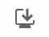
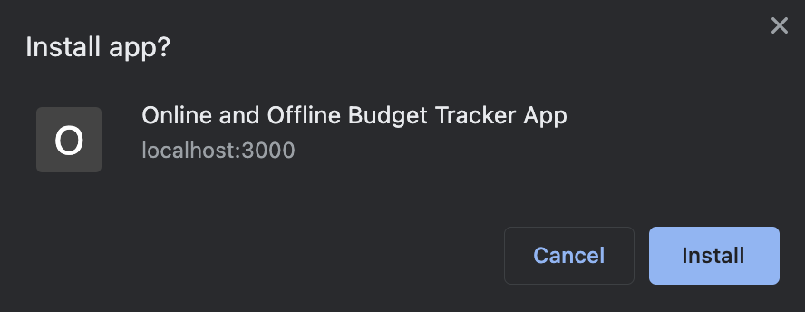

# Online/Offline Budget Tracker

Project by: Aaron Au Yoong
<br>

[](https://choosealicense.com/licenses/mit/)

## Table of Contents
* [Description](#Description)
* [License](#License)
* [Features](#Features)
* [Installation](#Installation)
* [Contributions](#Contributions)
* [Credits](#Credits)
* [Questions](#Questions)

## Description
This is a budget tracker application that allows users to add expenses and deposits to their budget with or without an active internet connection. When entering transactions offline, the data will populate the total when brought back online.

User Story:

```md
AS AN avid traveller
I WANT to be able to track my withdrawals and deposits with or without a data/internet connection
SO THAT my account balance is accurate when I am traveling

```
<br>

## License
MIT License
<br>
Copyright © 2021-Present Aaron Au Yoong. All rights reserved.

## Features

Offline Features:

  * Enter deposits offline

  * Enter expenses offline

Online Features:

  * Offline entries should be added to tracker.

## Installation
There are a few ways to access & install this application. 

The first method is to clone this repository, and install this on your local machine. To do so, please follow the steps below. 

1. Download this repository `budget-tracker`.

2. Install the basic npm packages by running the following command in your bash/terminal:

````
npm i -y
````

3. Install required dependencies by invoking the commands below. These include Express and Mongoose NPM Packages.

````
npm i express
npm i mongoose
````
Congratulations! You have successfully installed the budget tracker application in your local computer. 

The second method is to install the PWA to your local device (be it smartphone or desktop). To do so, you may follow the steps below:

<br> 



<br>

Simply search for the download icon above (it is typically to the left of the star/favourites icon if you are using Google Chrome). Then, a prompt similar to the one shown below will appear. Click install and follow any other instructions that appear to successfully install the app to your local device. 

<br>



<br>

## Contributions
For contributions, you may follow the industry standard: [Contributor Covenant](https://www.contributor-covenant.org/).
<br>

## Credits

* License badges used in this project were retrieved from GitHub user's `lukas-h` license-badge markdown file: [Markdown License badges](https://gist.github.com/lukas-h/2a5d00690736b4c3a7ba).
* README banner obtained from [Dreamstime](https://www.dreamstime.com/businessman-sitting-banknotes-piggy-bank-tracking-income-expences-budget-control-app-home-application-accounting-services-image137787358)

## Questions
Any questions? Feel free to contact me via my GitHub profile: [Aaron Au Yoong's GitHub Profile](https://github.com/aaronauyoong)
